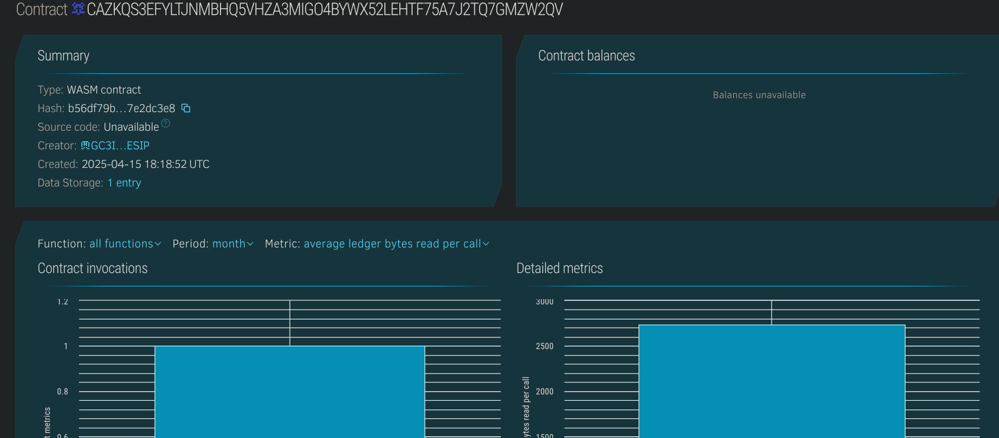

# Blockchain-Based Transcript

## Project Description
This project implements a Soroban smart contract for storing and accessing student transcripts on the Stellar blockchain. Each transcript includes a student's address, course name, grade, and timestamp, ensuring immutability and transparency.

## Project Vision
The goal of this project is to create a decentralized and tamper-proof record system for academic transcripts that institutions and students can trust, with the potential for global adoption in education.

## Key Features
- 📝 **Add Transcript:** Admins or institutions can add a transcript for a student.
- 🔍 **View Transcript:** Anyone can view a transcript by its unique record ID.
- 📊 **Track Records:** Query the total number of transcript entries stored.

## Future Scope
- 🔐 Add access control to restrict who can add records.
- 🏛 Integrate with educational institutions' backends.
- 🧾 Include multiple courses per student in one entry.
- 🌐 Enable verification APIs for employers and third parties.

## Contract Details
CAZKQS3EFYLTJNMBHQ5VHZA3MIGO4BYWX52LEHTF75A7J2TQ7GMZW2QV
